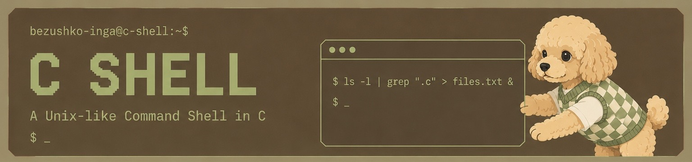
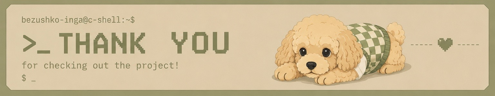

# C SHELL

<p align="center">
  
</p>


## Features

- Execution of external commands
- Built-in `cd` command
- Pipelines (`|`)
- Input and Output redirection (`<`, `>`)
- Append redirection (`>>`)
- Sequential execution (`;`)
- Background execution (`&`)
- Logical operators (`&&`, `||`)
- Command grouping with parentheses (`(...)`)

## Build

```bash
gcc shell.c -o shell
```

## Run

```bash
./shell
```

## Testing

```bash
chmod +x tests/run_tests.sh
./tests/run_tests.sh
```

<p align="center">
  
</p>
